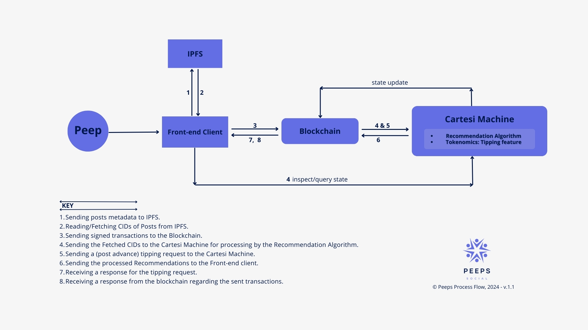
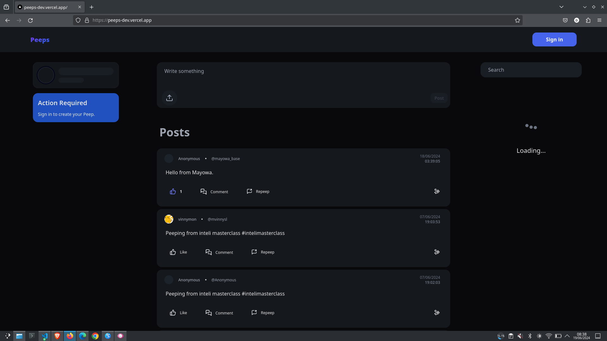
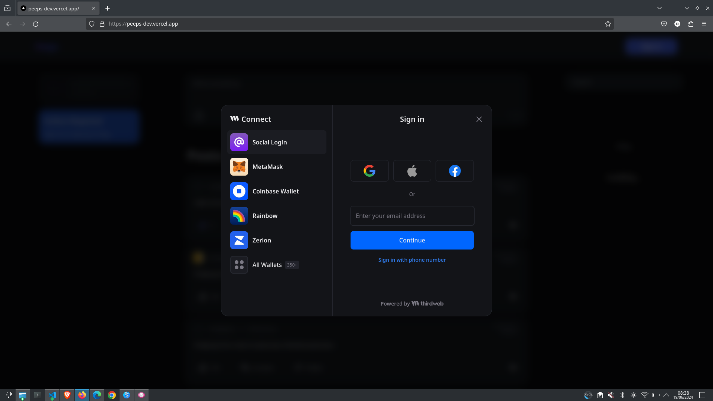
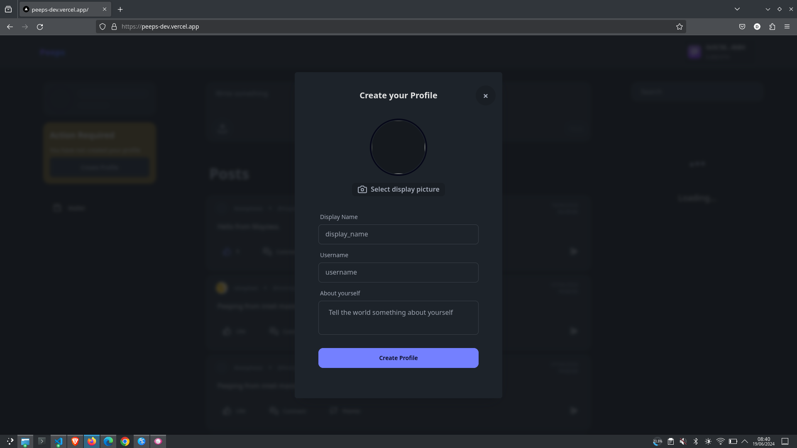
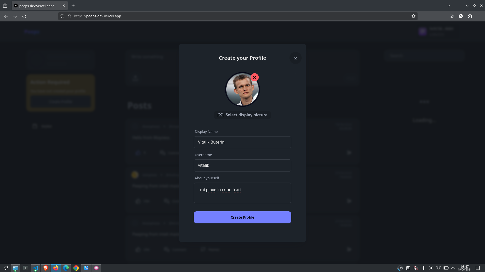
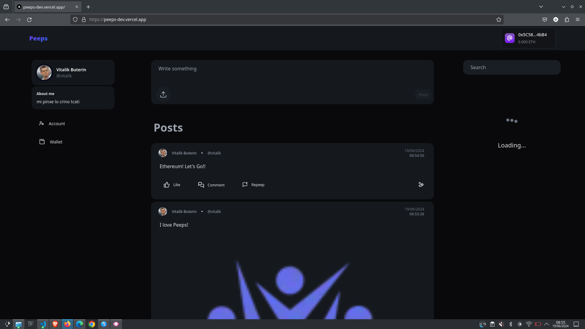
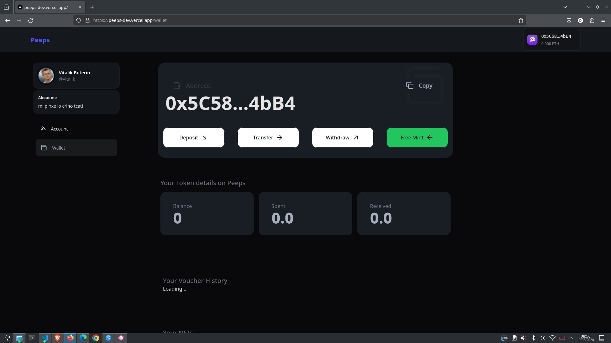
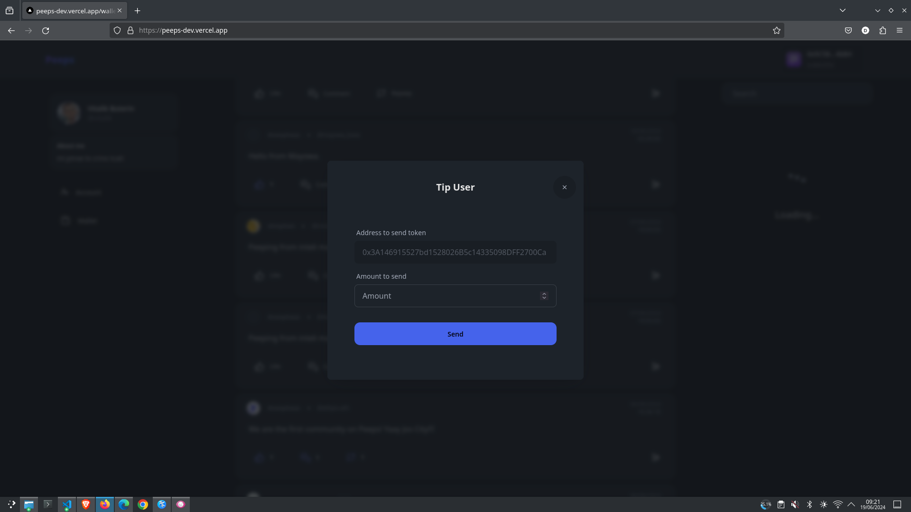

# PEEPS

Welcome to Peeps!

## OVERVIEW

Peeps is an innovative social media platform which brings the fusion of traditional micro-blogging with elements of blockchain's DeFi! 💬💼

Powered by Cartesi, users will enjoy classic social media features as well as leverage DeFi to create a seamless tipping system. Users can directly reward content creators they value with cryptocurrency, fostering a strong creator economy. All are driven by the Cartesi Machine's high computational power to run recommendation algorithms and facilitate payment. It aims to push the boundaries of conventional social networking by providing a more personalized, secure, and engaging experience for users.

This repository contains the source code for the MVP dApp of Peeps as built on Cartesi and deployed to the Arbitrum testnet.

## FEATURES

1. **Account Creation and Profile Set-Up:** With account abstraction functionalities provided by the integration of [Thirdweb's](https://portal.thirdweb.com/connect/sign-in/overview) SDK, users can create their accounts using social login (Gmail, Apple ID, Facebook, Email or Phone Number) or any of their supported Ethereum wallet of choice (Metamask, Coinbase, OKX, etc), this gives them access to interacting on the platform.
2. **Standard Social Media Functionality:** After users create their accounts, they now can create, read, comment and 'repeep' their posts as well as the posts of other users.
3. **Recommendation Algorithm:** Peeps runs a Recommendation Algorithm engine inside of the Cartesi machine which generates users' recommendations to posts and other contents based on their activities within Peeps. The recommendation algorithm tracks activities such as likes, comments and posts which suggest the user's interests and recommends to the user similar content. The Algorithm is custom-built by the Peeps Development team. The algorithm incorporates machine learning in classifying the posts made by users into predefined categories which will aid in suggesting post recommendations.
4. **Web 3 Wallet:** This feature distinguishes Peeps from other existing social media platforms as it allows users to leverage decentralized finance (DeFi) brought upon by Blockchain technology. Users regardless of their location can send and receive funds as well as other digital assets.
5. **Tipping Feature:** Peeps empowers creators in a decentralized way with a built-in tipping system. This feature harnesses the power of the underlying blockchain's DeFi capabilities to enable seamless, secure microtransactions. This feature will foster a direct connection between creators and their audience, building a community where value is directly rewarded.
6. **Custom Peeps Token:** Peeps uses a custom token to facilitate the tipping feature. The Peeps token is deployed to the Arbitrum Sepolia testnet, find the token address [here](https://sepolia.arbiscan.io/token/0x952949596423e916c5befaa050afd8b443e0d2c0).
7. **Integration with IPFS:** Peeps is integrated and makes use of the InterPlanetary File System (IPFS) for the storage of Peeps data. By leveraging IPFS, Peeps empowers a truly decentralized social media experience where users' content remains decentralized, secure, and accessible.

### Why Cartesi?

We chose Cartesi to run the social recommendations and incorporate DeFi into social media because it allows for implementing intricate recommendation algorithms and computations that might be challenging to accomplish using the Solidity language.

## LIVE THE EXPERIENCE WITH YOUR PEEPS

### Using live Peeps Demo dApp

1. Go to [Peeps live website](https://peeps-dev.vercel.app) to begin your journey in the future of decentralised social media experience.
2. On the demo dApp, you will be able to test the following features: 

- Social/Wallet Login

- Responsiveness: The dApp is responsive and is available for use on mobile, tab and desktop browsers.

- UI/UX: Using the demo dApp, you will be able to create and update your profile, and you will be able to create, like, comment and repeep posts as all these activities are integrated and stored on IPFS.

3. On the demo dapp, you will be able to see the trends, tipping and wallet functionalities.

Please let us know your feedback by sending an email to the development team <a href= "mailto: summitlabs.io@gmail.com"> here </a>.

### Testing Peeps Locally

**Alternatively**, you can clone this repository to run the Peeps source code locally on your device. Follow these instructions:

- From your terminal, clone this repo by running `git clone https://github.com/Joshaw-k/Peeps`.

- Then run `cd Peeps`.

- Then run `code .`, ***this is assuming that you are using VS Code as your preferred IDE***

- Then open the terminal in your VS Code and run `cd peeps_frontend`. Do follow all the instructions in the frontend folder, refer to the folder's documentation for guidance.

- After completing your frontend setup, change directory to the backend folder by running `cd ..` then run `cd peeps_backend`. Do follow all the instructions in the backend folder, refer to the folder's documentation for guidance.

- After completing the frontend and backend setup, change directory to the custom contracts folder by running `cd ..` then run `cd deploy-custom-contracts`. Do follow all the instructions in the custom contracts folder, refer to the folder's documentation for guidance.

- After completing all the setup, Peeps is available for use locally.

Please let us know your feedback by raising an issue on the repo on github or sending an email to the development team <a href= "mailto: summitlabs.io@gmail.com"> here </a>.

## TECHNOLOGY STACK

- **Frontend**: The entire frontend is developed with React. All assets, including fonts, images, and sprites for animations, are sourced from the internet.

- **Backend**: The backend is developed using Javascript and runs inside the Cartesi machine.

- **Smart Contracts**: The Peeps token smart contract is written in Solidity.

- **Frontend-Backend Interaction**: The front end interacts with the backend using Sunodo.

## PEEPS TECHNICAL ARCHITECTURE

## DEMO VIDEO

You can view the video by clicking [here](https://www.loom.com/share/).

## SCREENSHOTS OF PEEPS

---

So, drum-rolls please🥁, welcome to the future of decentralized social interactions powered by a convenient and friendly user interface that gives prioritsises optimal a wonderful experience!

*Note: The Peeps in this repository is an MVP version, most funtionlities work in their most basic form. Please use ERC-20 tokens responsibly and adhere to any relevant blockchain regulations.*